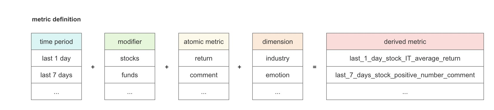
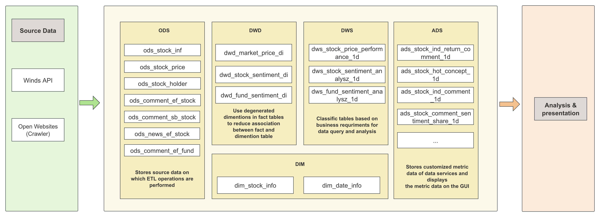
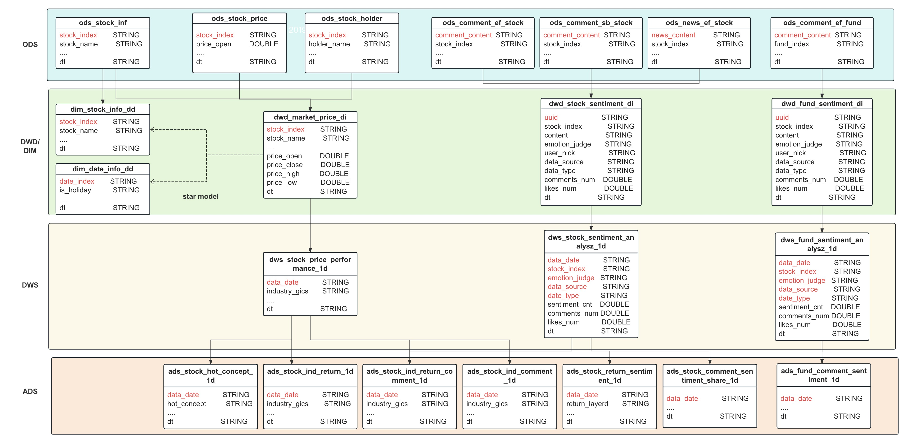

# QF5214-Group_15-Project
# Stock Market Dashboard Project Report

## Abstract
This report presents the development process and operational details of a stock market dashboard designed to combine quantitative financial data with qualitative sentiment analysis, thereby providing investors with a holistic view of market conditions. The dashboard serves as a tool for investors to make informed decisions by examining both numerical market data and the prevailing public sentiment towards the top stocks in the market.

## Problem Statement
After the Chinese stock market's steep decline in February and March, investors face a dilemma: has market sentiment bottomed out, signaling a time to buy the dip? If news headlines are overwhelmingly positive yet stock forum sentiments are bleak, it could signal an undervalued market ripe for investment. However, sifting through forums for individual comments is a time-consuming and inefficient process, and one might miss out on crucial sentiment indicators. Enter our dashboard, a fusion of real-time financial data and sentiment analysis, designed for the modern stock market. It navigates through numerical trends and investor psychology, offering a holistic view that guides investment strategies. This tool is a game-changer for investors aiming to make informed decisions in a fluctuating market.

## Introduction

The purpose of the dashboard is to provide a nuanced view of the stock market by integrating quantitative financial data with sentiment analysis. 

The development of this dashboard used the following tools and data sources:

- **Quantitative Financial Data**: Sourced from the Wind API, which offers extensive financial data for market analysis.

- **Sentiment Data**:
  Gained through Python-based web scraping
  - **Investor Sentiment**: Gained investor comments from the Guba and Snowball forums, focusing on the CSI 300 index stocks.
  - **Fund Sentiment**: Captures broader market sentiment commentary from the top 100 funds in China from Guba forums, reflecting macro investor sentiment.
  - **News Sentiment**: Collected from Guba financial news publications to incorporate objective sentiment influences on the market.

- **Sentiment Analysis Model**: Utilizes Baidu's Large Language Model (LLM) API for sentiment judgement, chosen for its accessibility and cost-effectiveness despite slower processing times.

- **Data Processing and ETL**: Carried out with Python to ensure efficient data extraction, transformation, and loading into the system.

- **Database and Cloud Integration**: Managed via cloud-based SQL databases to facilitate data handling and collaboration.

- **Visualization and Dashboard Interface**: Constructed with Power BI for its dynamic data visualization capabilities, enhancing the interactive experience for users.

## Dataset Description

The datasets for this project are multi-faceted, encompassing both financial data and sentiment data:

- **Financial Data**: Sourced from the Wind API, this dataset includes daily stock prices, trading volumes, and holder information. Key financial metrics, such as stock returns, are computed to establish a foundation for quantitative analysis. Additionally, we obtain detailed stock information, including the `industries` stocks belong to and `hot concepts` they are associated with. This information serves as vital dimensions for subsequent data aggregation and analysis.
  
- **Sentiment Data**: Extracted using Python web scrapers, this includes investor comments from Guba and Snowball, and news content related to stocks and funds. The sentiment is analyzed for positive or negative emotions using Baidu's LLM.

- **Metrics Definition**: Metrics are defined by a combination of time periods (e.g., last 1 day), entities (stocks, funds), and data types (daily return, comment). Derived metrics are created based on these definitions, such as 'last_7_days_stock_positive_number_comment' indicating the count of positive comments over the past week.

## Data Architecture and Data Pipeline

The stock market dashboard relies on a robust data architecture and pipeline designed for efficient data flow from source to presentation. The architecture is structured into several key layers, each serving a pivotal role in the processing and analysis of data.

### Data Sources
The foundation of our dashboard is built upon data acquired from diverse sources:
- **Wind API**: Provides a wealth of financial data points, including stock information and trading activities.
- **Web Crawlers**: These are utilized to gather sentiment data from various financial websites, capturing the mood and opinions of the market participants.

### ODS
This layer serves as the staging area for raw data:
- It contains tables for the initial storage of stock information , stock market data and sentiment data.

### DWD and DIM
After the data is collected, it goes through an ETL process and is loaded into our Data Warehouse, which has two components:
- **DWD**: Stores the detailed, atomic-level data. Integrates the `dt` field in all fact tables for data governance.
  - **Price and Volume Domain**: Here, we maintain the granularity at the daily level for each stock. The `dwd_market_price_di` fact table stores this daily price and volume information, providing a detailed view of market activities.
  - **Sentiment Domain**: This domain differentiates between stocks and funds to provide a focused view of market sentiment. 
    - Fact tables for sentiment are dedicated to stock sentiment (`dwd_stock_sentiment_di`) and fund sentiment (`dwd_fund_sentiment_di`), where each record corresponds to sentiment data for individual stocks and funds, respectively.
    - Sentiment cleansing and emotion tagging are critical processes completed in this layer. We standardize and clean the sentiment data from various sources before applying Baidu's LLM for emotion analysis, resulting in sentiment tags that classify data as positive, negative, or neutral. This enrichment allows for sophisticated sentiment-based insights into market trends.

- **DIM**: Includes dimension tables such as `dim_stock_info` and `dim_date_info`, which are used to add context to the facts through attributes like dates, stock indices, and industry sectors.

### DWS
This layer facilitates business intelligence and analysis:
- It includes tables that have been specifically designed based on business requirements. This includes summarizing data on dimensions such as time (e.g., daily aggregates), industry, and sentiment (e.g., overall market sentiment, sentiment by industry).
- This aggregation approach within the DWS lays the groundwork for insightful analytics, allowing for the synthesis of complex data into understandable and useful business metrics.

### ADS
The ADS is where the curated data for final presentation is stored:
- This includes tables like `ads_stock_ind_return_comment_1d`. These are constructed to feed customized metrics directly into the dashboard.

### Data Pipeline
The transformation of raw data into insights is a multi-stage process:
1. **Extraction**: We pull data from the Wind API and web via crawlers.
2. **Transformation**: Raw data undergoes cleaning, normalization, and enrichment within the DWD to fit our analytical schema.
3. **Loading**: Data is then loaded into DWD for detail storage and DIM for additional context.
4. **Processing**: In DWS, data is aggregated and analyzed based on business needs to provide a clearer view for data users.
5. **Presentation**: The ADS feeds into the dashboard, which visualizes the data, offering an interactive and insightful interface for users.

Each stage of this pipeline is designed to ensure data integrity and relevance, culminating in a powerful tool that provides comprehensive market insights.

Following is a detailed diagram that illustrates the multi-tiered data architecture of our stock market dashboard. This diagram provides a visual overview of the various components in our data pipeline, from the source data to the presentation layer.

## Implementation

This section outlines the technical implementation of our stock market dashboard, focusing on data collection and sentiment analysis.

### Web Crawling Sources

We utilized two primary sources for web scraping:

- **Xueqiu**: A leading Chinese financial platform that provides market data and investor insights.
  - Source: [Xueqiu](https://xueqiu.com/)
- **Eastmoney Guba**: A forum where users discuss stocks, mutual funds, and financial news.
  - Source: [Eastmoney Guba](https://guba.eastmoney.com/)

### Advanced Web Scraping Techniques

To collect data from Xueqiu and Eastmoney Guba, we designed sophisticated crawlers employing Python libraries like `requests`, `json`, `lxml`, `pandas`, `re`, and `pymysql`. Our scraping strategy included the following techniques to overcome anti-scraping measures:

1. **Local Proxy Pool Technique**:
   - We used a local proxy pool to prevent IP blocking, managed by the ProxyPool library, which ensures a supply of functional proxies.
   - Library: [ProxyPool](https://github.com/Python3WebSpider/ProxyPool?tab=readme-ov-file)

2. **Random User-Agent Header**:
   - A variety of user-agent strings are used to mimic genuine user behavior and reduce the risk of detection.

3. **Time Delay and Implicit Waits**:
   - To simulate human-like activity, we introduced random time intervals between requests and employed implicit waits for dynamic content loading.

### Spark and Scheduling Logic

We automated the execution of multiple spider programs through scheduling. The daily-collected data is processed using Spark for MapReduce operations and stored in databases categorized by source. We utilized `spark.py` for data processing and `CrawlerScheduler.py` for task scheduling, ensuring efficient and regular data updates.

### API Integration and Sentiment Analysis Process

#### Baidu AI API Usage Instructions

- Required Credentials: We used the APP_ID, API_KEY, and SECRET_KEY to authenticate with Baidu's sentiment analysis service.
- AI NLP Client: With the credentials, we instantiated `AipNlp` to analyze text sentiment.

#### Sentiment Analysis Model Description

The model includes:

- A sentiment analysis model classifies text as positive (return 1) if the positivity probability is above 0.7, negative (return -1) if below 0.3, and neutral (return 0) if between 0.3 and 0.7.
- A result integrity judgment module to verify analysis outcomes and handle non-compliant results.

### Data Retrieval and Processing

We extracted comments related to specific funds, applied sentiment analysis using Baidu AI Cloud API, and processed the data through various steps:

1. **Preliminary Inspection**: Quick review of the dataset's head and tail for an initial understanding.
2. **Data Sorting**: Organizing data by the `update_time` and other dimension fields for chronological consistency.
3. **Timestamp Addition**: Injecting a `input_date_time` field to log the ingestion time into our system.

### Data Aggregation

Our data aggregation process emphasizes consistency and scalability, requiring field standardization and ongoing evaluation to ensure compatibility as the dataset grows.

## Execution Instruction
- Step-by-step guide on how to run the dashboard

## Results
- Screenshots of the dashboard
- Discussion on the price data and sentiment analysis results

## Future Work

In considering the future trajectory of our stock market dashboard project, we have identified several avenues for enhancement and expansion:

### Cloud Infrastructure Migration

With additional funding, we can migrate our entire operation to the cloud. This move will not only facilitate scalability but also improve reliability and performance.
- **Automated Daily Data Updates**: Integrating scheduled tasks on the cloud will enable us to perform daily data refreshes seamlessly, ensuring our dashboard reflects the most up-to-date information.
- **Optimizing Spark’s Distributed Computing Power**: By running our Spark-based processing in the cloud, we can take full advantage of the cloud’s elasticity and scalability. This means our Spark jobs can dynamically allocate more resources during high demand and scale down during quieter periods, optimizing cost and performance.
- **Reliability and Maintenance**: Cloud platforms provide robust infrastructure and management services that can reduce the operational burden of maintaining a distributed system, thereby improving reliability and uptime.

### Architectural Adjustments for Real-Time Data Streaming

- **Streaming Architecture**: To elevate our dashboard to offer real-time insights, we need to revise our current architecture to support streaming data. This involves implementing robust data pipelines capable of handling high-velocity data inflow without latency or backlog issues.

### User Experience Optimization

- **Interactive Features**: Adding more interactive elements, such as customizable charts and user-driven queries, can significantly enhance user engagement and satisfaction.
- **Mobile Responsiveness**: Ensuring the dashboard is fully optimized for mobile devices will extend our reach and improve accessibility for users on the go.

## Conclusion
- Final thoughts on the project outcome

## Appendices
- Links to repositories, datasets, and additional resources

## Collaboration
- Details about how the team collaborated on GitHub
